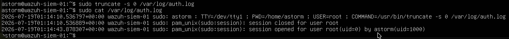
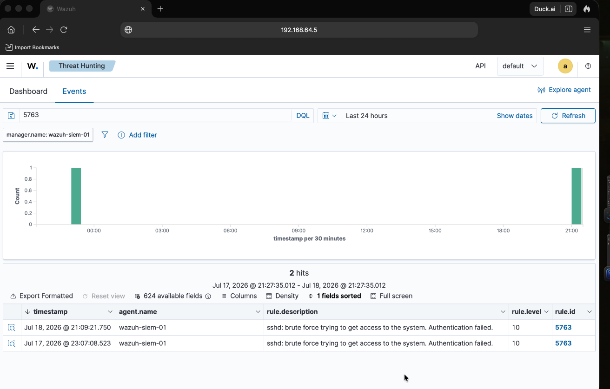

# Detecting Log Clearing (Defense Evasion) with Wazuh
**Author:** Alvin Espinoza
**Date:** 07/18/2026
**Focus Area:** SOC Detection

---

## 1. Objective
This lab shows that sometimes an attacker wants to cover their 
tracks by clearing the local logs. After wiping the auth log on 
the victim machine, the evidence was already preserved in Wazuh 
because the SIEM collects logs off the machine in real time. 
The attacker's cleanup came too late.

## 2. Environment & Tools

| Role                     | Machine                               | IP Address   |
| ------------------------ | ------------------------------------- | ------------ |
| Attacker                 | Kali Linux (nivla)                    | 192.168.64.7 |
| Defender / Target + SIEM | Ubuntu Server + Wazuh (wazuh-siem-01) | 192.168.64.5 |

**Tools used:**
- **truncate** - used to wipe the auth log, simulating an attacker clearing tracks
- **Wazuh** - open-source SIEM that had already collected the logs off the host
- **Hydra** - used earlier to generate the brute-force events being hidden

**Target log:** `/var/log/auth.log` (records every login and failed login on Linux)

**MITRE ATT&CK:** T1070.001 - Clear Linux or Mac System Logs (Defense Evasion)

## 3. Execution Log

1. Confirmed the Wazuh manager was running and both VMs were 
   live and reporting.

2. Verified the earlier brute-force events were already in 
   Wazuh (rule.id:5763, Level 10).

3. Wiped the log as the attacker would:
   `sudo truncate -s 0 /var/log/auth.log`
   Used truncate (not rm) because emptying the file is quieter 
   than deleting it. A little bit more stealthy!

4. Checked the wipe with `sudo cat /var/log/auth.log`. It 
   wasn't blank — the truncate command logged itself, so the 
   system recorded its own attempt at an event erase.

5. Filtered rule.id:5763 in Wazuh again. The brute-force 
   alerts from before the wipe were still there.

## 4. Results & Analyst Debrief
After we cleared /var/log/auth.log the SSH brute force alerts 
still survived. The Wazuh dashboard still showed rule 5763 from 
before the wipe. The attacker's cleanup came too late because it 
was already documented in Wazuh. I may be wrong but this is a 
crucial finding for myself on how Wazuh operates.

## Screenshots

**1. Terminal — auth.log wiped with truncate, system logs its own tampering**

**2. Wazuh — Rule 5763 brute-force alerts survived the wipe**

---
*End of Report*