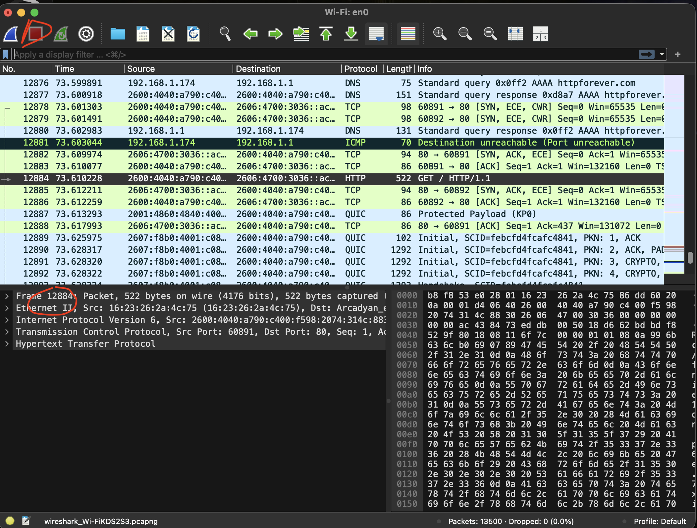
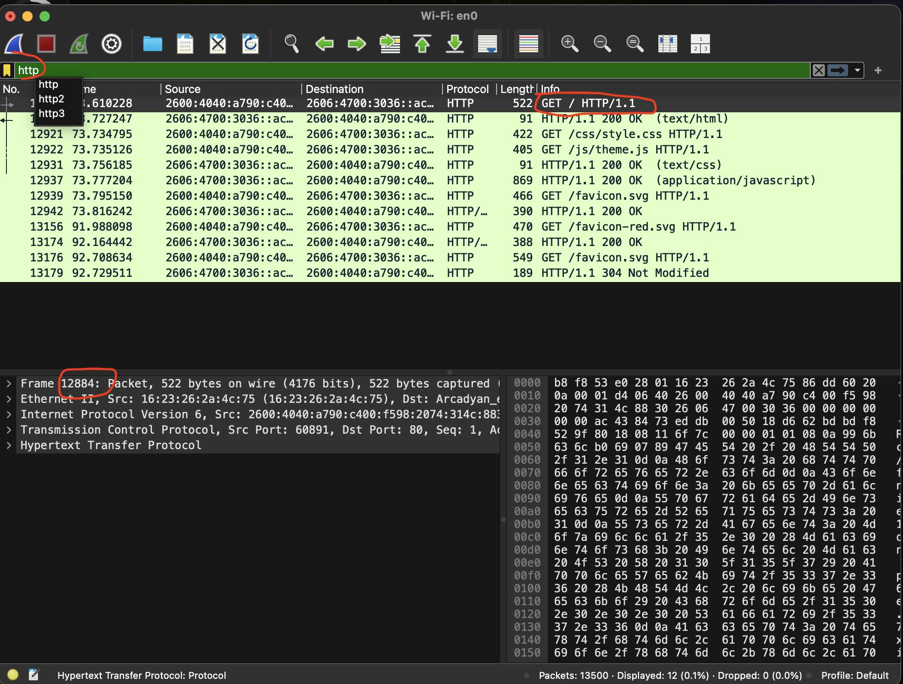

# Web Traffic Analysis: Plaintext vs. Encrypted (Wireshark)

**Author:** Alvin Espinoza **Date:** 07/21/2026 **Focus Area:** SOC Detection

---

## 1. Objective

I wanted to simulate a simple network sniffing exercise that SOC analysts work with everyday. I wanted to prove how much a SOC analyst can read encrypted vs unencrypted data when it comes to ports 443 and 80. I captured traffic that was running HTTP and also captured traffic to an HTTPS website. Almost all websites have HTTPS now so it was interesting to see data on a website with no TLS encryptions.

## 2. Environment & Tools

| Role                | Machine      | Address                         |
| ------------------- | ------------ | ------------------------------- |
| Analyst Wireshark | macOS laptop | 192.X.X.X (IPv4)                |
| Analyst (IPv6)      | macOS laptop | 2xxxxxxxxxxxxxx4:314c:883 |
| Local router / DNS  | Home gateway | 192.X.X.X                       |

**Tools used:**

- **Wireshark** - live packet capture and protocol analysis (interface `en0`)
- **Web browser** Safari - I generated the traffic by loading each site started clicking around.
- **Display filters** - `http`, `dns`, `tcp.flags.syn == 1`, `tls.handshake.type == 1`, `frame contains "..."`
- **Follow HTTP Stream** - to reassemble the plaintext conversation

**Targets:**

- **Plaintext:** `httpforever.com` 
- **Encrypted:** `krebsonsecurity.com` 

**Capture files:**

- Plaintext: 13,500 packets
- Encrypted:  5,457 packets

  ## 3. Execution Log

## httpforever.com

1. Started a live capture on wifi `en0`, loaded `http://httpforever.com` in the browser, and stopped the capture. **13,500 packets** were recorded.

2. Applied `http` narrowed the view to **12 packets . the `GET / HTTP/1.1` request, the `200 OK` response, and follow-up GETs.

3. Applied `dns` which pulled up **504 packets. Confirmed the name resolution step and saw the lookup for `httpforever.com`. Traffic evolved to IPV6 which was interesting.
![[03-dns-filter.png.png]]
4. Applied `tcp.flags.syn == 1` . I located the TCP three way handshake (`SYN` → `SYN, ACK` → `ACK`). This opened the connection before any data moved.
![[04-tcp-handshake.png]]
5. Right-clicked the `GET` packet → **Follow → HTTP Stream** (stream 69). The full conversation was ** readable**:
    - Request (red): `GET / HTTP/1.1`, `Host: httpforever.com`, and my browser's full `User-Agent` (Chrome on macOS).
    - Response (blue): `HTTP/1.1 200 OK`, `Server: cloudflare`, `Content Type: text/html`, and every security header in plaintext.
![[05-follow-http-stream.png]]
6. Analyzed background noise the capture picked up: DNS lookups for `twitter.com`, `android.clients.google.com`, and `beacons.gcp.gvt2.com`, heavy **QUIC (HTTP/3)** traffic, and one **TCP Retransmission** from `34.223.124.45` a live network hiccup where a packet had to be sent again. I was proud to have caught that little hiccup. 

## Krebsonsecurity.com

7. Restarted wireshark to pull up `https://krebsonsecurity.com` again and it gave me **5,457 packets**.
8. Applied `frame contains "krebs"` **6 packets**, all **DNS**. The lookups and responses for `krebsonsecurity.com` were visible in **cleartext**. my DNS is not encrypted, so the domain I visited leaked plainly. The A record response returned Krebs's public IP address `<130.211.45.45>`. It was on packet 564
![[07-krebs-dns.png]]

9. Applied `tcp.flags.syn == 1`  **32 packets **. Confirmed TCP handshakes to port **443** (HTTPS), alongside a large amount of **QUIC/HTTP-3** on UDP 443 , the newer, UDP based version of web traffic. 

10. Applied `tls.handshake.type == 1` **39 packets** the **Client Hello** messages. Each one exposed its destination domain in cleartext with the Server Name section field, even though the connections are encrypted: `accounts.google.com`, `mtalk.google.com`, `android.clients.google.com`, and others from background apps on my machine.

11. Drilled into a Client Hello in the Packet Details pane: `Transport Layer Security` → `Handshake Protocol: Client Hello`, where the server name indicator extension and negotiated TLS version were readable. Everything after the handshake rides inside TLS as encrypted **Application Data**, which is not readable.

## 4. Results & Analyst Debrief

**SOC takeaway:** When triaging a modern encrypted network alert, I won't be able to read the payload, however I can still build a strong picture from the metadata.  I can use it to detect any unusual activity from the domain (DNS  and SNI), and the destination IP. This also showed me how noisy a real capture can get. My wireshark generated a lot of background connections that I had to filter through to find the traffic I was actually trying to find. 

**What still leaks, even over HTTPS:**

- The **domain name** 
- The **destination IP** and **port**
- The **TCP/TLS handshake** 

**What encryption hides:**

- The exact URL/path and the page content.

